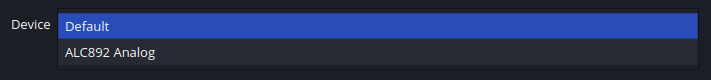
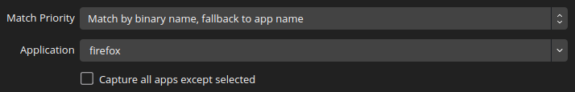

# Audio device and application capture for OBS Studio using PipeWire 

This plugin adds 3 sources for capturing audio outputs, inputs and applications using [PipeWire](https://pipewire.org)  



## Usage
### Requirements
- OBS Studio 28.0 or later
- [WirePlumber](https://pipewire.pages.freedesktop.org/wireplumber/)

PipeWire 0.3.62 or later is highly recommended ([#17](https://github.com/dimtpap/obs-pipewire-audio-capture/issues/17), [PipeWire#2874](https://gitlab.freedesktop.org/pipewire/pipewire/-/issues/2874))

For the plugin to be able to capture applications, PipeWire should be set up to handle audio on your system.
For most applications, the [`pipewire-pulse`](https://gitlab.freedesktop.org/pipewire/pipewire/-/wikis/FAQ#should-i-uninstall-everything-pulseaudio)
compatibility layer should be enough, but there are also `pipewire-jack` and `pipewire-alsa`.
If applications aren't showing up in the plugin, your system may be missing one of those components.  
See the [PipeWire wiki](https://gitlab.freedesktop.org/pipewire/pipewire/-/wikis/home) for more info.

### Installation
1. Get the `linux-pipewire-audio-(version).tar.gz` archive from the [latest release](https://github.com/dimtpap/obs-pipewire-audio-capture/releases/latest)
2. In OBS Studio, go to **File**, then click **Show Settings Folder**
3. In the folder that opens, create a folder called `plugins` if it doesn't already exist
4. Extract the archive you downloaded in the `plugins` folder
5. Restart OBS Studio
6. If you're using the Flatpak and the sources aren't working, run `flatpak override --filesystem=xdg-run/pipewire-0 com.obsproject.Studio` and restart OBS Studio

Your files should look like this
```
.../obs-studio/plugins
├── linux-pipewire-audio
│   ├── bin
│   │   └── 64bit
│   │       └── linux-pipewire-audio.so
│   └── data
│       └── locale
│           ...           
```
> [!IMPORTANT]
> ## Flatpak users note
> ***THIS INSTALLATION METHOD IS UNSUPPORTED BY THE OBS STUDIO TEAM AND CAN BREAK AT ANY TIME***  
> This plugin relies on a Flatpak permission that OBS Studio could remove at any time, so it can't be on Flathub.  
> If after updating OBS Studio the plugin stops working, check the latest release for a new version, or build the plugin yourself
> against the latest OBS Studio.
> 
> Note that native OBS Studio packages do not have this problem.

### Building (for development)
Ensure you have CMake, PipeWire and OBS Studio/libobs development packages, then in the repo's root:
```sh
cmake -B build -DCMAKE_INSTALL_PREFIX="/usr" -DCMAKE_BUILD_TYPE=RelWithDebInfo
cmake --build build
# To install it system-wide:
cmake --install build
```
## Inclusion in upstream OBS Studio
This plugin is currently in the process of being worked on to merge into upstream OBS Studio. See https://github.com/obsproject/obs-studio/pull/6207
